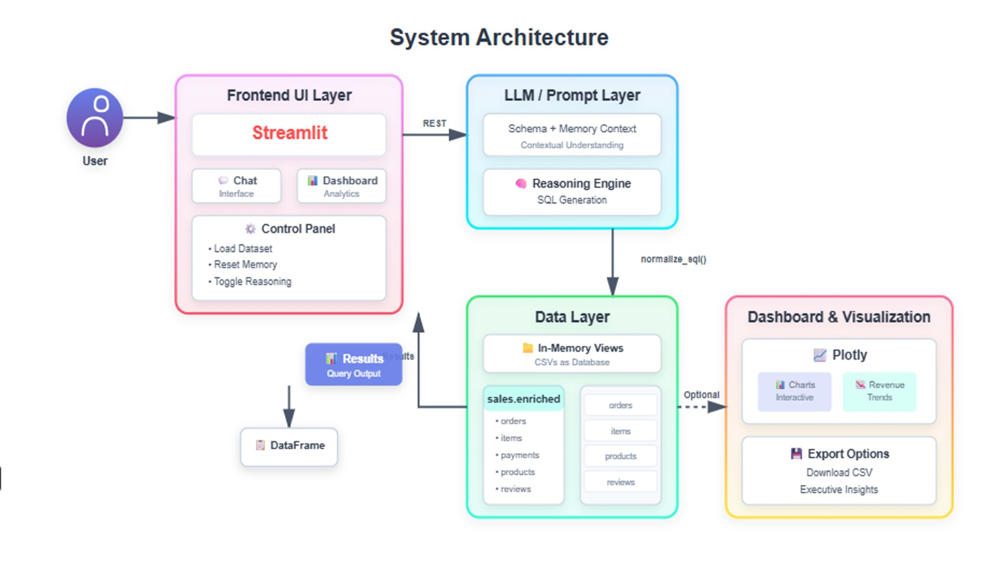

# MAER.AI — Conversational Commerce Analyst
*AI-powered insights for ecommerce datasets, using Gemini 2.0 + DuckDB + Streamlit*

Powered by Gemini 2.0 + DuckDB + Streamlit

MAER.AI (Machine-driven Analytics for Ecommerce Reasoning) is an AI-powered conversational analytics system that converts natural-language business questions into live SQL queries, runs them against the Olist ecommerce dataset using DuckDB, and returns actionable insights, visual dashboards, and downloadable reports.

The name MAER.AI is inspired by Maersk, representing reliability and global commerce — while the acronym reflects the system’s mission:

Machine-driven
Analytics for
Ecommerce
Reasoning

## 📦 Dataset Download (Required)

This project uses the **Olist Brazil Ecommerce Dataset**.

Because the dataset is large, it is **not included in the GitHub repo**.

Download it here (official source):
🔗 https://www.kaggle.com/datasets/olistbr/brazilian-ecommerce

🌟 Demo Features
🧠 Conversational AI Agent

Ask natural questions like:

“What were the top 5 categories by sales last month?”

“Which states have the highest review scores?”

“Show me the monthly revenue trend.”

The agent:

Understands natural language

Generates SQL with reasoning

Corrects broken queries

Adds business insights (“Executive Insights”)

📊 Visual Dashboard

Revenue trends (line chart)

Top categories (bar chart)

KPIs: Total revenue, orders, unique cities, avg ratings

Fully interactive and beautifully styled Apple x IBM inspired UI

💾 SQL Lab

Manually write SQL

Validate queries

Export results

Perfect for debugging or exploration

🏛️ Architecture Overview

Here is the architecture diagram included in the repo:
architecture.png

High-Level Architecture
┌───────────────────────────────┐
│          Streamlit UI         │
│  - Chat agent interface        │
│  - Dashboard KPIs + Plots      │
│  - SQL Lab                     │
└───────────────┬───────────────┘
                │
                ▼
┌───────────────────────────────┐
│      LLM / Agent Layer        │
│  - Translation agent           │
│  - SQL generation agent        │
│  - Error correction agent      │
│  - Insight generation agent    │
└───────────────┬───────────────┘
                │ SQL
                ▼
┌───────────────────────────────┐
│       DuckDB (In-memory)      │
│ - Loads Olist dataset CSVs     │
│ - Creates `sales_enriched`     │
│ - Executes all SQL queries     │
└───────────────────────────────┘

🛠️ Tech Stack
Layer	Technology
Frontend UI	Streamlit
AI Model	Gemini 2.0 Flash (Google AI Studio)
SQL Engine	DuckDB (in-memory)
Data Storage	Raw CSV (Olist)

📦 Dataset Used

This project uses the Olist Brazil Ecommerce Dataset
Place all CSVs inside:

data/olist/

Your folder should look like:

data/olist/
├── olist_orders_dataset.csv
├── olist_order_items_dataset.csv
├── olist_order_reviews_dataset.csv
├── olist_order_payments_dataset.csv
├── olist_products_dataset.csv
├── olist_customers_dataset.csv
└── ...

▶️ How to Run the App Locally
1️⃣ Clone the repository
git clone https://github.com/AnvithaAnand/maer_ai.git
cd maer_ai

2️⃣ Install dependencies
pip install -r requirements.txt

3️⃣ Add your Gemini API key

Create a .env file:

GEMINI_API_KEY=your_key_here
MODEL_NAME=gemini-2.0-flash

4️⃣ Run the Streamlit app
streamlit run app.py

The app will open in your browser at:

http://localhost:8501

☁️ Deploy on Streamlit Cloud

Push repo to GitHub

Go to: https://share.streamlit.io

Deploy using app.py

Add secrets:

GEMINI_API_KEY="your_key_here"
MODEL_NAME="gemini-2.0-flash"

Ensure your data/ folder is pushed (Streamlit Cloud needs it!)

🧠 Design Decisions
✔ Why DuckDB?

In-memory, extremely fast

Zero-setup

Perfect for analytics workloads

Works with raw CSVs without ETL

✔ Why Gemini for SQL reasoning?

Excellent structured output

Built-in chain-of-thought style reasoning

Strong multilingual + data understanding

Lower latency compared to other LLMs

✔ Why Streamlit?

Fastest way to build interactive dashboards

Built-in chat UI

Deploys seamlessly on Streamlit Cloud

✔ Why build sales_enriched view?

Unifies all Olist tables into a single analytics-friendly table:
Orders + Items + Products + Customers + Payments + Reviews

🚀 What I Would Build Next (Future Work)

To show vision + depth, here are extensions:

🔮 1. NL → Python pivot / chart generation

The agent could generate custom charts automatically.

🔍 2. LLM-based anomaly detection

Identify drops in revenue, spikes in freight, etc.

📦 3. Product recommendation engine

Collaborative filtering using customer purchase history.

🧮 4. Predictive forecasting (Prophet / ARIMA)

Future revenue / demand prediction.

🧩 5. Multi-dataset support

Upload any ecommerce dataset — MAER.AI auto-detects schema & builds queries.

💎 Why MAER.AI Stands Out (for Judges)
✔ Breadth

Chat agent, SQL reasoning, dashboard, SQL lab, insights, custom UI.

✔ Depth

LLM agent pipeline, date-correct SQL logic, inference guards, DuckDB views.

✔ UX & Polish

Apple × IBM themed interface, animations, gradients, branded components.

✔ Innovation

A hybrid “NL → SQL → Insights” pipeline built end-to-end from scratch.

✔ Communication

Clean architecture, clear documentation, structured reasoning in code.

📝 License

MIT License — Free to use, modify, and distribute.

🧑‍💻 Author

Anvitha Anand
Built with ❤️ using Gemini + DuckDB + Streamlit
Visualization	Plotly
Secrets	python-dotenv
Styling	Custom CSS (Apple x IBM Vision UI)
